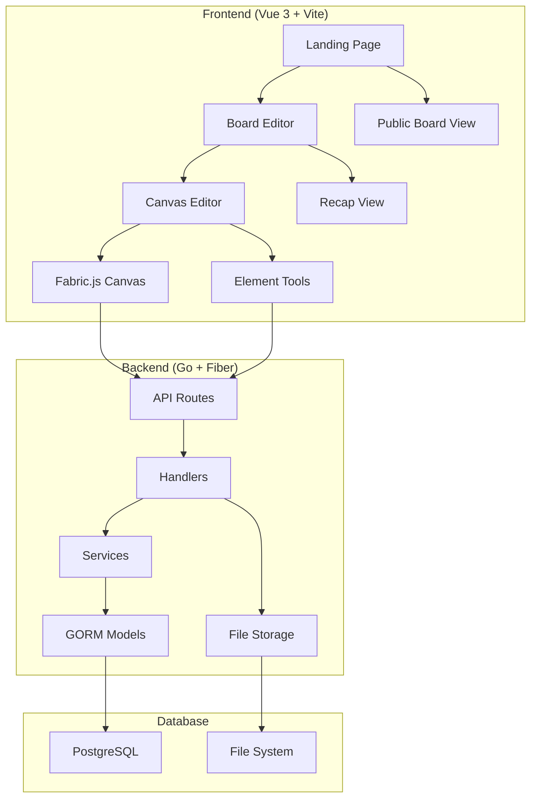

# Design Document

## Overview

The Junk Journal & Board application follows a modern three-tier architecture with a Go backend using Fiber framework, Vue 3 frontend with TypeScript, and PostgreSQL database. The system is designed around token-based access control without traditional authentication, making it simple to share and collaborate. The core functionality revolves around a canvas-based editor using Fabric.js for rich interactive element manipulation.

## Architecture

### System Architecture



### Technology Stack

**Frontend:**
- Vue 3 with Composition API and TypeScript for type safety
- Vite for fast development and optimized builds
- Pinia for state management with TypeScript support
- Vue Router for client-side routing
- Tailwind CSS for utility-first styling
- Fabric.js for advanced canvas manipulation
- html2canvas for client-side PNG export
- Axios for HTTP client with interceptors
- dayjs for date manipulation

**Backend:**
- Go 1.22+ with Fiber web framework for high performance
- GORM v2 for database ORM with PostgreSQL driver
- Zap for structured logging
- google/uuid for UUID generation
- CORS middleware for cross-origin requests
- Local file storage with organized directory structure

**Database:**
- PostgreSQL 14+ with UUID extensions
- Database migrations using golang-migrate
- Proper indexing for performance optimization

**Infrastructure:**
- Docker Compose for local development
- Makefile for common development tasks
- Environment-based configuration

## Components and Interfaces

### Backend Components

#### Models Layer
```go
// Board represents a journal board
type Board struct {
    ID          uuid.UUID `gorm:"type:uuid;primary_key"`
    Title       string    `gorm:"not null"`
    Skin        string    `gorm:"default:'default'"`
    EditToken   uuid.UUID `gorm:"type:uuid;unique;not null"`
    PublicToken uuid.UUID `gorm:"type:uuid;unique;not null"`
    CreatedAt   time.Time
    UpdatedAt   time.Time
    Pages       []Page    `gorm:"foreignKey:BoardID"`
}

// Page represents a journal page within a board
type Page struct {
    ID        uuid.UUID `gorm:"type:uuid;primary_key"`
    BoardID   uuid.UUID `gorm:"type:uuid;not null;index"`
    Title     string    `gorm:"not null"`
    Date      time.Time `gorm:"not null;index"`
    OrderIdx  int       `gorm:"not null;index"`
    CreatedAt time.Time
    UpdatedAt time.Time
    Elements  []Element `gorm:"foreignKey:PageID"`
}

// Element represents a canvas element on a page
type Element struct {
    ID        uuid.UUID       `gorm:"type:uuid;primary_key"`
    PageID    uuid.UUID       `gorm:"type:uuid;not null;index"`
    Kind      string          `gorm:"not null;check:kind IN ('text','image','sticker','shape')"`
    X         float64         `gorm:"not null"`
    Y         float64         `gorm:"not null"`
    W         float64         `gorm:"not null"`
    H         float64         `gorm:"not null"`
    Rotation  float64         `gorm:"default:0"`
    Z         int             `gorm:"default:0;index"`
    Payload   datatypes.JSON  `gorm:"type:jsonb"`
    CreatedAt time.Time
    UpdatedAt time.Time
}
```

#### Service Layer Architecture
- **BoardService**: Handles board CRUD operations, token validation
- **PageService**: Manages page lifecycle, ordering, date filtering
- **ElementService**: Canvas element operations, batch updates, z-ordering
- **UploadService**: File upload, validation, storage management
- **RecapService**: Analytics and summary generation

#### Handler Layer
- RESTful API endpoints with consistent error handling
- Token-based authorization middleware
- Request/response DTOs for clean API contracts
- File upload handling with multipart form support

### Frontend Components

#### State Management (Pinia)
```typescript
// useBoards store
interface BoardsState {
  currentBoard: Board | null
  pages: Page[]
  editToken: string | null
  loading: boolean
}

// useEditor store  
interface EditorState {
  selectedElementIds: string[]
  undoStack: CanvasState[]
  redoStack: CanvasState[]
  snapToGrid: boolean
  canvas: fabric.Canvas | null
}
```

#### Vue Components Architecture
- **CanvasEditor.vue**: Main Fabric.js integration with element manipulation
- **Toolbar.vue**: Element creation tools and canvas controls
- **SidebarLayers.vue**: Layer management and element hierarchy
- **ThemePicker.vue**: Theme selection and preview
- **ImageUploader.vue**: Drag-and-drop file upload interface
- **ShareExportBar.vue**: URL sharing and PNG export functionality
- **RecapHeader.vue**: Date range filtering controls
- **RecapGrid.vue**: Grid layout for recap page thumbnails

#### Canvas Integration
The canvas editor uses Fabric.js for advanced manipulation:
- Custom element types extending fabric.Object
- Event handlers for selection, modification, and deletion
- Debounced API persistence to optimize network calls
- Snap-to-grid functionality with visual grid overlay
- Multi-select operations with group manipulation

## Data Models

### Database Schema

```sql
-- Enable UUID extension
CREATE EXTENSION IF NOT EXISTS "uuid-ossp";

-- Boards table
CREATE TABLE boards (
    id UUID PRIMARY KEY DEFAULT uuid_generate_v4(),
    title TEXT NOT NULL,
    skin TEXT DEFAULT 'default',
    edit_token UUID UNIQUE NOT NULL DEFAULT uuid_generate_v4(),
    public_token UUID UNIQUE NOT NULL DEFAULT uuid_generate_v4(),
    created_at TIMESTAMPTZ DEFAULT NOW(),
    updated_at TIMESTAMPTZ DEFAULT NOW()
);

-- Pages table with indexing for performance
CREATE TABLE pages (
    id UUID PRIMARY KEY DEFAULT uuid_generate_v4(),
    board_id UUID NOT NULL REFERENCES boards(id) ON DELETE CASCADE,
    title TEXT NOT NULL,
    date TIMESTAMPTZ NOT NULL,
    order_idx INTEGER NOT NULL,
    created_at TIMESTAMPTZ DEFAULT NOW(),
    updated_at TIMESTAMPTZ DEFAULT NOW()
);

CREATE INDEX idx_pages_board_order ON pages(board_id, order_idx);
CREATE INDEX idx_pages_date ON pages(date);

-- Elements table with JSONB payload
CREATE TABLE elements (
    id UUID PRIMARY KEY DEFAULT uuid_generate_v4(),
    page_id UUID NOT NULL REFERENCES pages(id) ON DELETE CASCADE,
    kind TEXT NOT NULL CHECK (kind IN ('text','image','sticker','shape')),
    x FLOAT NOT NULL,
    y FLOAT NOT NULL,
    w FLOAT NOT NULL,
    h FLOAT NOT NULL,
    rotation FLOAT DEFAULT 0,
    z INTEGER DEFAULT 0,
    payload JSONB,
    created_at TIMESTAMPTZ DEFAULT NOW(),
    updated_at TIMESTAMPTZ DEFAULT NOW()
);

CREATE INDEX idx_elements_page_z ON elements(page_id, z);
```

### Element Payload Structures

```typescript
// Text element payload
interface TextPayload {
  content: string
  fontFamily: string
  fontSize: number
  color: string
  bold: boolean
  italic: boolean
  textAlign: 'left' | 'center' | 'right'
}

// Image element payload
interface ImagePayload {
  url: string
  originalWidth: number
  originalHeight: number
  filters?: fabric.IBaseFilter[]
}

// Shape element payload
interface ShapePayload {
  shapeType: 'rectangle' | 'circle' | 'triangle'
  fill: string
  stroke: string
  strokeWidth: number
}

// Sticker element payload
interface StickerPayload {
  stickerType: string
  url: string
  category: string
}
```

## Error Handling

### Backend Error Handling
Consistent error response format across all endpoints:

```go
type ErrorResponse struct {
    Error struct {
        Code    string `json:"code"`
        Message string `json:"message"`
        Details any    `json:"details,omitempty"`
    } `json:"error"`
}
```

Error categories:
- **BAD_REQUEST**: Invalid input data or malformed requests
- **UNAUTHORIZED**: Invalid or missing edit tokens
- **NOT_FOUND**: Requested resources don't exist
- **FORBIDDEN**: Access denied for public tokens on edit operations
- **INTERNAL_ERROR**: Server-side errors with logged details
- **VALIDATION_ERROR**: Input validation failures

### Frontend Error Handling
- Global error interceptor in Axios for consistent error handling
- Toast notifications for user-facing error messages
- Retry logic for network failures
- Graceful degradation for non-critical features
- Error boundaries for component-level error isolation

## Testing Strategy

### Backend Testing
- **Unit Tests**: Service layer business logic with mocked dependencies
- **Integration Tests**: Database operations with test database
- **API Tests**: HTTP endpoint testing with test client
- **File Upload Tests**: Multipart form handling and validation

### Frontend Testing
- **Unit Tests**: Vue components with Vue Test Utils
- **Integration Tests**: Pinia store operations and API integration
- **Canvas Tests**: Fabric.js interaction and element manipulation
- **E2E Tests**: Critical user flows with Playwright

### Test Data Management
- Database migrations for test schema setup
- Seed data generation for consistent test scenarios
- Cleanup procedures for isolated test runs
- Mock file upload handling for frontend tests

## Performance Considerations

### Backend Optimization
- Database indexing on frequently queried fields
- Connection pooling for PostgreSQL
- Debounced API calls from frontend to reduce server load
- Efficient JSON serialization for element payloads
- File upload size limits and validation

### Frontend Optimization
- Lazy loading of canvas elements for large pages
- Virtual scrolling for element lists in sidebar
- Image optimization and caching
- Debounced canvas state persistence
- Memory management for undo/redo stacks

### Caching Strategy
- Browser caching for static assets (themes, stickers)
- API response caching for read-only operations
- Canvas state caching for smooth undo/redo
- Image thumbnail generation and caching

## Security Considerations

### Token-Based Security
- UUID v4 tokens for cryptographically secure randomness
- Separate edit and public tokens for access control
- Token validation on all mutation operations
- No token exposure in public API responses

### File Upload Security
- File type validation using MIME type checking
- File size limits to prevent abuse
- Organized storage structure to prevent path traversal
- Unique filename generation to prevent conflicts

### Input Validation
- Server-side validation for all API inputs
- SQL injection prevention through GORM parameterization
- XSS prevention through proper output encoding
- CORS configuration for allowed origins

## Deployment Architecture

### Development Environment
- Docker Compose with hot reload for both frontend and backend
- Database migrations run automatically on startup
- Volume mounts for persistent data and file uploads
- Environment variable configuration for different stages

### Production Considerations
- Reverse proxy configuration for API routing
- Static file serving optimization
- Database connection pooling and monitoring
- Log aggregation and monitoring setup
- Backup strategy for database and uploaded files